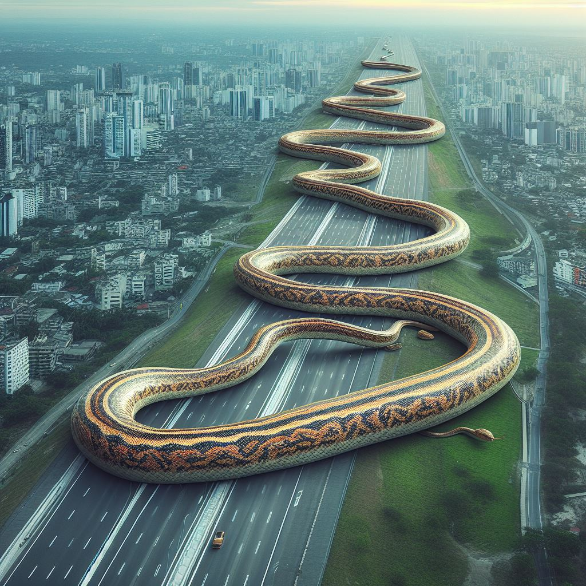

# DALL-E

A painting of WALL-E in the style of Salvador Dali.

## Overview and Origin

* Name of company

**DALL-E is an artificial intelligence system that can turn text prompts into AI generated art. It is being developed by OpenAI.
DALL-E has had 3 major versions so far:**

* DALL-E: January 2021
* DALL-E 2: April 2022
* DALL-E 3: October 2023

DALL-E can be accessed by going to:
https://www.bing.com/images/create

A book that literally never ends.

A free Microsoft account is needed to create images. After typing in prompt, generating four images typically only takes fifteen seconds (3.75 seconds per image), but image generation can sometimes take longer during times of the day when bandwidth is spread thin due to heavy use. Every day, users are given fifteen “boosts” which is practically a guarantee that four images will be generated in fifteen seconds. After the fifteen boosts are used up, images can still be generated, but they may take longer than fifteen seconds to generate, depending on current global use of DALL-E.

The paid ChatGPT-4 can also be used to create DALL-E images, but not the free ChatGPT-3.5.

* When was the company incorporated?

OpenAI was founded on December 10, 2015 in San Francisco.

* Who are the founders of the company?

OpenAI was founded by Ilya Sutskever, Greg Brockman, Trevor Blackwell, Vicki Cheung, Andrej Karpathy, Durk Kingma, John Schulman, Pamela Vagata, and Wojciech Zaremba. (https://openai.com/blog/introducing-openai)

A vampire that is skilled in martial arts, demonstrating his skills against his opponents in a spooky looking castle courtyard.

* How did the idea for the company (or project) come about?

DALL-E was inspired by OpenAI’s work on ChatGPT. With the ability to create stories and ideas from prompts, naturally the company wanted to expand this to art generation as well.

* How is the company funded? How much funding have they received?

In 2015, the founders, along with Sam Altman, Reid Hoffman, Jessica Livingston, Peter Thiel, Elon Musk, Amazon Web Services, Infosys, and YC Research intended to raise over $1 billion to the venture and has received $130.5 million in donations. In 2019, OpenAI transitioned from a non-profit to a capped-profit company. In 2023, OpenAI received $10 billion in funding from Microsoft!

[OpenAI] (https://openai.com/our-structure)
[TechCrunch] (https://techcrunch.com/2019/03/11/openai-shifts-from-nonprofit-to-capped-profit-to-attract-capital/)
[Reuters] (https://www.reuters.com/technology/openai-seeks-valuation-up-90-bln-sale-existing-shares-wsj-2023-09-26)

## Business Activities

* What specific problem is the company or project trying to solve?

DALL-E can quickly create beautiful artwork astronomically faster than a human can. It can also create art in a variety of art styles that are vastly different from one another. Images can be used to quickly inspire artists, prototype ideas and designs, and spruce up corporate presentations and marketing materials.

Mountains of beautiful, colorful ice cream. Colorful stars are in the sky.

* Who is the company's intended customer? Is there any information about the market size of this set of customers?

The intended areas of use include:
* designers
* artists
* content creators
* researchers
* advertising
* marketing
* entertainment
* fashion
* personal, non-business use

It is hard to put an exact number on the market size, but since AI art image generation is so beneficial to many industries, the market size is massive.

A chess board made of pizza with chess pieces made of cookies.

* What solution does this company offer that their competitors do not or cannot offer? (What is the unfair advantage they utilize?)
DALL-E can be accessed thorough a web browser and requires signing in through a free Microsoft account. DALL-E is very easy to use and only requires that a user types in a prompt. Alternatively, a user can click “surprise me” to have DALL-E come up with a prompt for them.

The main competitors are Midjourney and Stable Diffusion. Midjourney requires a free Discord account, and the image prompting and generation is done through Discord instead of in a web browser. Midjourney allows more customization of the images beyond the initial prompt, but has a much higher learning curve than DALL-E. All three image generators create images that are 1024 by 1024 pixels, but the images generated with Midjourney can be upscaled to 2048 by 2048 if a user wishes.

DALL-E is much simpler to use than Midjourney, Stable Diffusion or the other AI art models that are available on Hugging Face. DALL-E, as an OpenAI project, also has the financial backing of Microsoft, which could bode well for the future of new editions of DALL-E.

Huge monster is eating Earth-like planets while laughing about it and floating around in a galaxy. We can see the molten interiors of the planets. A few stars are nearby, and their sunspots are arranged in such a way as to look like they are watching with surprised and slightly fearful faces. A black hole nearby is spewing out material in two different polar jets.

* Which technologies are they currently using, and how are they implementing them?

DALL-E uses neural networks and CLIP (Contrastive Language-Image Pre-training) which is a model that has been trained on 400 million pairs of images that also include text captions. The images and captions were used by DALL-E to predict what objects and situations should look like in an image.

## Landscape

Extremely massive mansion on a floating island made of sharp rock spires. The mansion contains many floors, towers, and intricate stained-glass windows. The mansion is surrounded by a super fancy and intricate gate with golden statues adorning the posts. A waterfall of vibrantly bright red wine is pouring out of the bottom of the island. The sky is filled with clouds that are roughly shaped like animals.

* What field is the company in?

OpenAI is in the field of AI, and particularly, generative AI. They are known for ChatGPT, DALL-E, and the yet to be released Soren, which will be a short movie generator.

* What have been the major trends and innovations of this field over the last 5&ndash;10 years?

AI has made significant strides in image recognition, natural language processing, and generative models. Generative Adversarial Networks (GANs) have also been influential in creating realistic images from noise or other data inputs.

* What are the other major companies in this field?

Other companies developing tools and technologies in the image generation sector include:

* Google (DeepMind)
* Meta (Facebook AI Research)
* NVIDIA

When it comes to customer-facing AI art generation tools, some examples include Midjourney and Stable Diffusion. One major difference between DALL-E and Midjourney…

> blockquote
"DALL-E excels in generating realistic images from textual prompts, while Midjourney empowers users to enhance and transform visuals through its intuitive interface."

[SimpleLearn] (https://www.simplilearn.com/dalle-vs-midjourney-vs-stable-difussion-article)

Photorealistic. The longest snake in the world is so long that it’s slithering in and out of almost every road in a city simultaneously.

## Results

* What has been the business impact of this company so far?

DALL-E has sparked a huge interest in the power of AI generated art. At the same time, this interest has worried many artists about the future of their career. Many have already lost their jobs, and especially entry level position artists.
[Business Insider] https://www.businessinsider.com/ai-taking-jobs-fears-artists-say-already-happening-2023-10

* What are some of the core metrics that companies in this field use to measure success? How is your company performing based on these metrics?

DALL-E can generate some very high-quality images that fit the prompts well. DALL-E also uses a lot of creative freedom that happens when these images are generated. The user prompts can range from short and generic to intricately detailed. Approximately 34 million images are created with DALLE-3 every day!

* How is your company performing relative to competitors in the same field?

In 2023, most AI images (12.6 billion) were made using Stable Diffusion, an open-source AI art generator. DALL-E, Midjourney, and Adobe Firefly each had about 1 billion images generated. While there were significantly less DALL-E images created when compared to Stable Diffusion images, DALL-E is much better at getting the general public to try out AI image generation with its simple, easy to use, user-friendly interface. For software developers and users of GitHub, Stable Diffusion is easy to use, but for the general public, not so much. That’s one reason why OpenAI probably has the upper hand here.

Hyperrealism. We are outside on a balcony that is part of a castle on a crisp and clear full moon night. Fireflies are enjoying themselves in various fields around us. A waterfall can be seen in the distance.

## Recommendations

* If you were to advise the company, what products or services would you suggest they offer?

I would suggest that they turn DALL-E and Microsoft’s Copilot designer into their own dedicated, full-screen, fully featured app for Windows, MacOS, iOS, Android, smart TVs, and gaming consoles. The interface could include a GUI that could be customized with AI art, professional looking menus and controls, and even optional sound effects and GUI animations. Many simple quality of life features should be implemented, such as automatic saving and downloading of images. (Currently you must save images to your Microsoft account and/or download them manually, and this is very tedious and time consuming if you enjoy creating a lot of AI art).

I would also suggest that OpenAI and DALL-E follow the US constitution by honoring free speech and not restrict or censor any prompts. However, their definition of what is “ethical” is different than mine. The content restrictions are a bit over-the-top for some prompts. For example, DALL-E will block any prompt with the word “breast” in it, even if the prompt is just of a “chicken breast”. However, you can prompt engineer to get around that by entering “chicken cutlet” instead of “chicken breast”, and the generator will accept that. At the very least, DALL-E needs to say exactly why a prompt was blocked, not simply just block the prompt. Sometimes DALL-E lets you report a blocked prompt as being a prompt that shouldn’t have been blocked, but other times, it simply just blocks the prompt. Microsoft claims that they will ban Microsoft accounts that repeatedly enter prompts that get blocked, but they don’t give details on how many prompts can be blocked before the account is banned. I find that practice to be extremely draconian.

There should be a live, real-time feature that generates additional images when prompts are being typed in. With the generation of one image only taking 3.75 seconds, a lot of fun and creative images would be generated while someone is entering and modifying their prompts. Even while typing at 60 words per minute, a lot of variations and varieties of an image could be created. If these were downloaded automatically, it would make the entire experience even more fun.

* Why do you think that offering this product or service would benefit the company?

OpenAI could turn the DALL-E app into a marketplace as well so that content creators could sell their art in the form of drawings, sketches, paintings, prints, and eventually, even 3D printed figurines, statues, furniture, and clothing. Even if a content creator is not selling their art to others, it would be very convenient (for the content creator) and lucrative (for OpenAI) to be able to take some AI art that you created, and then have it printed in a frame to hang on a wall, printed on a coffee mug, or printed on a tee-shirt.

* What technologies would this additional product or service utilize?
  
The functional AI art marketplace would need to utilize traditional printing and 3D printing technologies. It would also become a content creator marketplace with the potential for huge success, such as YouTube, but be funded by taking a cut of the sales, and not funded by ads.

* Why are these technologies appropriate for your solution?
  
The human mind has no bounds when it comes to creativity, art, and technologies. However, not everyone is a skilled artist when it comes to traditional or digital art mediums. It requires the right brain and mindset. Many people have great ideas on how to make their life better but lack the talent and capital to turn those dreams into reality. With more quality-of-life features and more of an integration into real-world marketplaces, DALL-E could be revolutionary in the feats that it could accomplish.

A massive swimming pool that is laid out just like a hedge maze, angled perspective.

* ## Additional Sources

[Business Insider] (https://www.businessinsider.com/ai-taking-jobs-fears-artists-say-already-happening-2023-10)

[Every Pixel Journal] (https://journal.everypixel.com/ai-image-statistics#:~:text=More%20than%2015%20billion%20images,34%20million%20images%20per%20day)

[Global Market Insights] (https://www.gminsights.com/industry-analysis/ai-image-generator-market)

[Hierarchical Text-Conditional Image Generation with CLIP Latents] (https://arxiv.org/abs/2204.06125)

[Microsoft Blog] (https://blogs.microsoft.com/blog/2023/09/21/announcing-microsoft-copilot-your-everyday-ai-companion/)

[Midjourney Docs] (https://docs.midjourney.com/docs/upscalers#:~:text=Select%20Upscale,to%202048%20x%202048%20pixels)

[New Yorker] (https://www.newyorker.com/magazine/2022/07/11/dall-e-make-me-another-picasso-please)

[OpenAI - DALL-E 2] (https://openai.com/dall-e-2)

[OpenAI - DALL-E 3] ((https://openai.com/dall-e-3)

[OpenAI Blog] (https://openai.com/blog/dall-e-api-now-available-in-public-beta)

[OpenAI Blog] (https://openai.com/blog/dall-e-now-available-without-waitlist)

[Petapixel] (https://petapixel.com/2024/02/08/ai-images-generated-on-dall-e-now-contain-the-content-authenticity-tag/)

[Spectrum] (https://spectrum.ieee.org/dall-e-fashion-design)

[TechCrunch] (https://techcrunch.com/2021/01/05/openais-dall-e-creates-plausible-images-of-literally-anything-you-ask-it-to/)

[The Guardian] (https://www.theguardian.com/technology/2022/jun/19/from-trump-nevermind-babies-to-deep-fakes-dall-e-and-the-ethics-of-ai-art)

[The Verge] (https://www.theverge.com/2023/9/20/23881241/openai-dalle-third-version-generative-ai)

[Zero-Shot Text-to-Image Generation] (https://arxiv.org/pdf/2102.12092)
